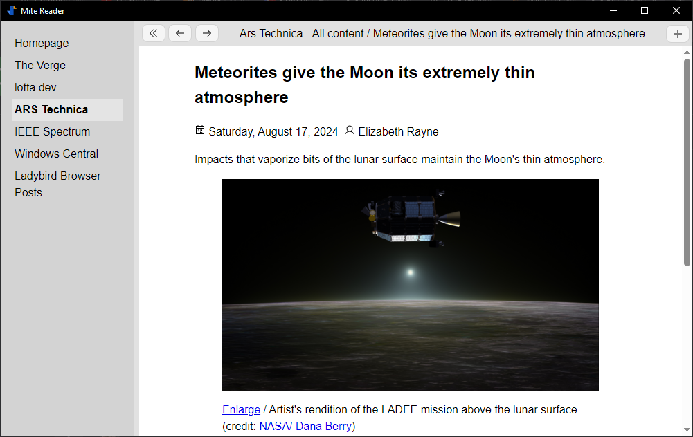

# Mite

> Note that Mite is in alpha. While the application is usable, expect bugs!

A really simple RSS/Atom reader for your desktop.



## Features

- Includes feed auto-discovery allowing you to locate feeds easily.
- Supports RSS 2.0 and Atom.

## Todo

- [ ] Dark mode (plus themes)
- [ ] Read/unread markers
- [ ] Subscription organizing
- [ ] Podcast support
- [ ] Scheduled polling
- [ ] Inbox/homepage
- [ ] JSON feed support
- [ ] OPML import/export
- [ ] Multiple languages

## Developing

To run the project locally (after cloning):

```bash
npm i
npm run dev
```
